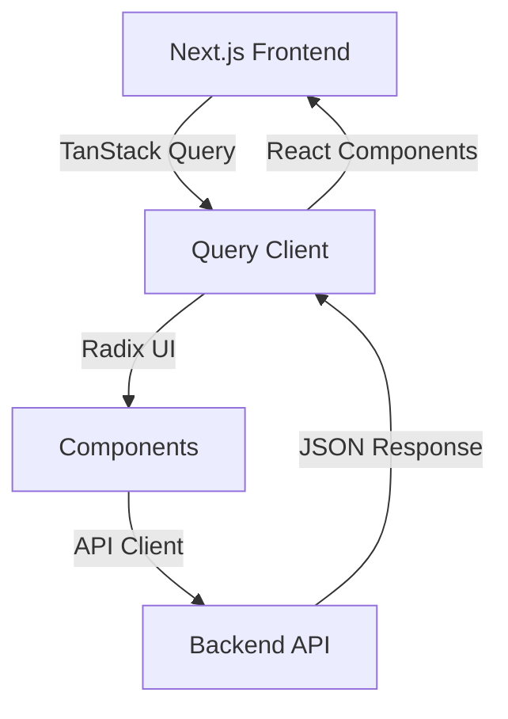

# Frontend Architecture Guide

## Unified Frontend Architecture with TanStack Query & Radix UI

This comprehensive guide establishes all frontend best practices and architectural patterns for the project.

---

## Architecture Overview



---

## Packages vs Apps Architecture Principle

### ⚠️ CRITICAL: Separation of Concerns

**MANDATORY RULE**: Design system components, reusable UI components, and imperative APIs MUST reside in `packages/`, not in `apps/`.

### Package Structure

```
UI/
├── packages/
│   ├── ui/              # Design system & reusable UI components
│   │   └── src/
│   │       └── components/
│   │           └── Toast.tsx      # Styled components, imperative APIs
│   └── lib/             # Business logic hooks, API clients
│       └── src/
│           └── hooks/   # React Query hooks, utilities
│
└── apps/
    └── web/             # Application-specific code ONLY
        ├── app/         # Next.js pages & layouts
        ├── components/ # Business components (combine packages)
        └── lib/         # App-specific types, validations
```

### What Goes Where?

#### ✅ Packages (`packages/ui/` and `packages/lib/`)

**Design System Components:**
- Styled wrapper components for Radix UI Primitives
- Reusable UI components (Toast, Dialog wrappers, etc.)
- Imperative APIs (toast.show(), dialog.open(), etc.)
- Theme-aware components
- Components that can be used across multiple apps

**Business Logic:**
- React Query hooks (`useProjects`, `useTasks`, etc.)
- API client functions
- Shared utilities and helpers
- Type definitions shared across apps

**Examples:**
```typescript
// ✅ packages/ui/src/components/Toast.tsx
export function ToastProvider() { ... }
export function useToast() { ... }

// ✅ packages/lib/src/hooks/use-projects.ts
export function useProjects() { ... }
```

#### ✅ Apps (`apps/web/`)

**Application-Specific Code:**
- Next.js pages and layouts (`app/` directory)
- Business components that combine packages (`components/`)
- App-specific types and validations (`lib/types/`, `lib/validations/`)
- Minimal layout styling (positioning, app-specific spacing)

**Examples:**
```typescript
// ✅ apps/web/components/ProjectCard.tsx
// Combines packages/ui components with business logic
import { Card, Button } from '@radix-ui/themes'
import { useProjects } from '@cron-observer/lib'
import { useToast } from '@cron-observer/ui'

// ✅ apps/web/app/layout.tsx
// App-specific layout structure
```

### ❌ FORBIDDEN: Design System in Apps

**NEVER put these in `apps/web/components/`:**
- Styled wrapper components for primitives
- Imperative APIs (toast, dialog, etc.)
- Reusable design system components
- Components that could be used in other apps

**Why this matters:**
- ✅ **Reusability**: Components can be shared across multiple apps
- ✅ **Maintainability**: Single source of truth for design system
- ✅ **Consistency**: All apps use the same components
- ✅ **Testability**: Components can be tested in isolation
- ✅ **Scalability**: Easy to add new apps that share components

### Migration Pattern

When you find yourself creating a reusable component in `apps/web/components/`:

1. **Ask**: "Could another app use this?"
2. **If yes**: Move to `packages/ui/src/components/`
3. **Export**: Add to `packages/ui/src/index.ts`
4. **Import**: Use `import { Component } from '@cron-observer/ui'`

### Example: Toast Component Migration

**Before (❌ WRONG):**
```typescript
// apps/web/components/StyledToast.tsx
export function StyledToastRoot() { ... }
```

**After (✅ CORRECT):**
```typescript
// packages/ui/src/components/Toast.tsx
export function ToastProvider() { ... }
export function useToast() { ... }

// apps/web/components/ExecutionsList.tsx
import { useToast } from '@cron-observer/ui'
const toast = useToast()
toast.success('Task paused')
```

---

## 1. API Client with TanStack Query

### Setup Query Provider

```typescript
// apps/web/src/providers/query-provider.tsx
'use client'

import { QueryClient, QueryClientProvider } from '@tanstack/react-query'
import { ReactQueryDevtools } from '@tanstack/react-query-devtools'
import { useState } from 'react'

export function QueryProvider({ children }: { children: React.ReactNode }) {
  const [queryClient] = useState(() =>
    new QueryClient({
      defaultOptions: {
        queries: {
          refetchOnWindowFocus: false,
          retry: 1,
          staleTime: 5 * 60 * 1000,
          gcTime: 10 * 60 * 1000, // Previously cacheTime
        },
        mutations: {
          retry: 0,
        },
      },
    })
  )

  return (
    <QueryClientProvider client={queryClient}>
      {children}
      <ReactQueryDevtools initialIsOpen={false} />
    </QueryClientProvider>
  )
}
```

### API Service Layer Pattern

```typescript
// apps/web/src/services/entity.service.ts
import { useQuery, useMutation } from '@tanstack/react-query'
import { api } from '../lib/api-client'

// Types
export interface Entity {
  id: string;
  name: string;
  // ... other fields
}

// Query Keys - Hierarchical structure for cache invalidation
export const entityKeys = {
  all: ['entities'] as const,
  lists: () => [...entityKeys.all, 'list'] as const,
  list: (filters?: Record<string, unknown>) => [...entityKeys.lists(), { filters }] as const,
  details: () => [...entityKeys.all, 'detail'] as const,
  detail: (id: string) => [...entityKeys.details(), id] as const,
}

// Query Hooks
export const useEntities = (filters?: Record<string, unknown>) => {
  return useQuery({
    queryKey: entityKeys.list(filters),
    queryFn: async () => {
      const response = await api.get('/entities', { params: filters })
      return response.data
    }
  })
}

export const useEntity = (id: string) => {
  return useQuery({
    queryKey: entityKeys.detail(id),
    queryFn: async () => {
      const response = await api.get(`/entities/${id}`)
      return response.data
    },
    enabled: !!id
  })
}

// Mutation Hooks
export const useCreateEntity = () => {
  return useMutation({
    mutationFn: async (data: Partial<Entity>) => {
      const response = await api.post('/entities', data)
      return response.data
    },
    onSuccess: () => {
      // Invalidate list queries
      queryClient.invalidateQueries({ queryKey: entityKeys.lists() })
    }
  })
}
```

---

## 2. Radix UI Component Patterns

### ⚠️ CRITICAL: Design System Components Only

**STRICT RULE: Raw HTML elements are ABSOLUTELY FORBIDDEN**

This is a **MANDATORY** architectural requirement. All UI elements MUST use Radix UI components.

- ❌ **NEVER use**: `div`, `p`, `span`, `h1-h6`, `button`, `input`, `select`, `textarea`, `ul`, `ol`, `li`, `a`, `img`, `section`, `article`, `header`, `footer`, `nav`, `main`, `aside`, or any other raw HTML elements
- ✅ **ALWAYS use**: 
  - **Layout/Typography**: Components from `@radix-ui/themes` (Box, Flex, Grid, Text, Heading, Button, Card, Spinner, etc.)
  - **Interactive Primitives**: Components from `@radix-ui/react-*` packages (Dialog, Select, Checkbox, etc.)
  - **Business Components**: Custom composite components from `@cron-observer/ui` (only for business logic, not design system)

**Why this rule exists:**
- Ensures consistent design language across the application
- Enables centralized theme control through Radix UI Themes
- Provides accessibility features out of the box
- Maintains design system integrity
- Makes theming and customization easier
- Separates concerns: design system (Radix) vs business logic (`@cron-observer/ui`)

### Component Usage Guide

```typescript
// ✅ CORRECT: Using Radix UI components from individual packages
import * as Dialog from '@radix-ui/react-dialog'
import * as AlertDialog from '@radix-ui/react-alert-dialog'
import * as DropdownMenu from '@radix-ui/react-dropdown-menu'
import * as Select from '@radix-ui/react-select'
import * as Tabs from '@radix-ui/react-tabs'
import * as Toast from '@radix-ui/react-toast'
import * as Tooltip from '@radix-ui/react-tooltip'
import * as Checkbox from '@radix-ui/react-checkbox'
import * as RadioGroup from '@radix-ui/react-radio-group'
import * as Switch from '@radix-ui/react-switch'
import * as Avatar from '@radix-ui/react-avatar'
import * as Separator from '@radix-ui/react-separator'
import * as Slider from '@radix-ui/react-slider'
import * as Popover from '@radix-ui/react-popover'
import * as Accordion from '@radix-ui/react-accordion'

// Dialog Example
<Dialog.Root>
  <Dialog.Trigger>Open</Dialog.Trigger>
  <Dialog.Content>
    <Dialog.Title>Title</Dialog.Title>
    <Dialog.Description>Description</Dialog.Description>
  </Dialog.Content>
</Dialog.Root>

// Alert Dialog Example
<AlertDialog.Root>
  <AlertDialog.Trigger>Delete</AlertDialog.Trigger>
  <AlertDialog.Content>
    <AlertDialog.Title>Confirm</AlertDialog.Title>
    <AlertDialog.Description>Are you sure?</AlertDialog.Description>
    <AlertDialog.Action>Yes</AlertDialog.Action>
    <AlertDialog.Cancel>No</AlertDialog.Cancel>
  </AlertDialog.Content>
</AlertDialog.Root>

// Select Example
<Select.Root>
  <Select.Trigger>Select option</Select.Trigger>
  <Select.Content>
    <Select.Item value="1">Option 1</Select.Item>
    <Select.Item value="2">Option 2</Select.Item>
  </Select.Content>
</Select.Root>

// Popover Example (Primitive with Themes components inside)
<Popover.Root>
  <Popover.Trigger asChild>
    <Button variant="soft" size="2">Open</Button>
  </Popover.Trigger>
  <Popover.Content style={{ padding: 'var(--space-3)' }}>
    <Box>
      <Text size="3" weight="medium" mb="2">Title</Text>
      <Text size="2" color="gray">Description</Text>
    </Box>
  </Popover.Content>
</Popover.Root>

// Toast Example (Primitive with Themes components inside)
// Option 1: Direct usage with inline styles (for one-off cases)
<Toast.Provider>
  <Toast.Root style={{ backgroundColor: 'var(--green-9)', padding: 'var(--space-3)' }}>
    <Box>
      <Text size="3" weight="medium" style={{ color: 'white' }}>Success</Text>
      <Text size="2" style={{ color: 'white' }}>Message</Text>
    </Box>
  </Toast.Root>
  <Toast.Viewport />
</Toast.Provider>

// Option 2: Using imperative API (RECOMMENDED - from packages/ui)
import { useToast } from '@cron-observer/ui'

const toast = useToast()
toast.success('Task paused successfully')
toast.error('Failed to update task', 'Error')
```

**Creating Styled Wrapper Components:**

When you need to reuse styling for primitives across multiple components, create styled wrapper components in `packages/ui/src/components/`:

```typescript
// ✅ CORRECT: packages/ui/src/components/Toast.tsx
import * as Toast from '@radix-ui/react-toast'
import { Box, Text } from '@radix-ui/themes'
import { createContext, useContext } from 'react'

// Styled components
export function StyledToastRoot({ type, title, children, ...props }) {
  return (
    <Toast.Root
      style={{
        backgroundColor: type === 'success' ? 'var(--green-9)' : 'var(--red-9)',
        padding: 'var(--space-3)',
        borderRadius: 'var(--radius-3)',
        // ... theme tokens
      }}
      {...props}
    >
      <Box>
        {title && <Text size="3" weight="medium">{title}</Text>}
        <Text size="2">{children}</Text>
      </Box>
    </Toast.Root>
  )
}

// Imperative API
export function ToastProvider({ children }) { ... }
export function useToast() { ... }
```

**Usage in Apps:**
```typescript
// ✅ apps/web/app/layout.tsx
import { ToastProvider } from '@cron-observer/ui'

<ToastProvider>
  <App />
</ToastProvider>

// ✅ apps/web/components/SomeComponent.tsx
import { useToast } from '@cron-observer/ui'

const toast = useToast()
toast.success('Operation completed')
```

**Benefits:**
- ✅ Reusable styling across the application
- ✅ Consistent theming with centralized theme tokens
- ✅ Easier maintenance (update styling in one place)
- ✅ Cleaner component code (less inline styles)
- ✅ Imperative API for better developer experience
- ✅ Components live in packages, not apps
```

**Component Architecture Philosophy:**

This architecture separates concerns into three clear layers:

1. **Radix UI Themes (`@radix-ui/themes`)**: Provides all design system components
   - Layout: Box, Flex, Grid, Container
   - Typography: Text, Heading, Strong, Em
   - Buttons: Button, IconButton
   - Cards: Card, Inset
   - Feedback: Spinner, Badge, Separator
   - **Purpose**: Complete design system with built-in theming
   - **Priority**: ALWAYS prefer Themes components when available

2. **Radix UI Primitives (`@radix-ui/react-*`)**: Provides unstyled, accessible interactive components
   - Dialogs, Selects, Checkboxes, Radio Groups, Switches
   - Dropdowns, Popovers, Tooltips, Tabs, Accordions, Toasts
   - **Purpose**: Accessible primitives for complex interactions
   - **Usage**: Use when Themes doesn't provide the component, but ALWAYS style with Themes tokens and use Themes components inside them

3. **Business Components (`@cron-observer/ui`)**: Custom composite components
   - **ONLY** for components that combine multiple Radix components with business logic
   - Examples: TaskCard (combines Card + Button + business logic), ProjectList (combines Grid + Card + data fetching logic)
   - **NOT** for design system components (use `@radix-ui/themes` instead)
   - **Purpose**: Reusable business logic components

### Component Preference Hierarchy

**MANDATORY RULE**: Always follow this order when selecting components:

1. **First Choice**: Radix UI Themes components (`@radix-ui/themes`)
   - Use when available: Box, Flex, Text, Heading, Button, Card, Spinner, Badge, etc.
   - These components are fully styled and theme-aware

2. **Second Choice**: Radix UI Primitives (`@radix-ui/react-*`) styled with Themes
   - Use when Themes doesn't provide the component (e.g., Popover, Toast, Dialog)
   - **CRITICAL**: Always use Themes components (Box, Text, Button, etc.) inside primitives
   - Always use Themes styling tokens (`var(--space-*)`, `var(--color-*)`, etc.)
   - Example: `<Popover.Content>` should contain `<Box>`, `<Text>`, `<Button>` from Themes

3. **Last Resort**: Custom components
   - Only for business logic that combines multiple Radix components
   - Must still use Radix components internally, never raw HTML

### Component Selection Guide

| **Use Case** | **Component** | **Import Source** | **Notes** | **❌ FORBIDDEN** |
|-------------|--------------|------------------|----------|-----------------|
| **Layout** | `Box`, `Flex`, `Grid`, `Container` | `@radix-ui/themes` | ✅ Themes component | `div`, `section`, `article`, `main`, `aside` |
| **Typography** | `Text`, `Heading`, `Strong`, `Em` | `@radix-ui/themes` | ✅ Themes component | `p`, `span`, `h1-h6`, `strong`, `em` |
| **Buttons** | `Button`, `IconButton` | `@radix-ui/themes` | ✅ Themes component | `button` |
| **Cards** | `Card`, `Inset` | `@radix-ui/themes` | ✅ Themes component | `div` with border/shadow |
| **Feedback** | `Spinner`, `Badge`, `Separator` | `@radix-ui/themes` | ✅ Themes component | Custom spinners, `hr` |
| **Dialogs** | `Dialog.*`, `AlertDialog.*` | `@radix-ui/react-dialog`, `@radix-ui/react-alert-dialog` | ⚠️ Primitive - use Themes components inside | `div` with custom modal |
| **Dropdowns** | `DropdownMenu.*` | `@radix-ui/react-dropdown-menu` | ⚠️ Primitive - use Themes components inside | Custom dropdown |
| **Select** | `Select.*` | `@radix-ui/react-select` | ⚠️ Primitive - use Themes components inside | `select` |
| **Tabs** | `Tabs.*` | `@radix-ui/react-tabs` | ⚠️ Primitive - use Themes components inside | Custom tab implementation |
| **Toast** | `Toast.*` | `@radix-ui/react-toast` | ⚠️ Primitive - use `Text`, `Box` from Themes inside | Custom toast |
| **Tooltip** | `Tooltip.*` | `@radix-ui/react-tooltip` | ⚠️ Primitive - use Themes components inside | `title` attribute |
| **Forms** | `Checkbox.*`, `RadioGroup.*`, `Switch.*` | `@radix-ui/react-checkbox`, `@radix-ui/react-radio-group`, `@radix-ui/react-switch` | ⚠️ Primitive - use Themes components inside | `input[type="checkbox"]`, `input[type="radio"]` |
| **Avatar** | `Avatar.*` | `@radix-ui/react-avatar` | ⚠️ Primitive - use Themes components inside | `img` for avatars |
| **Popover** | `Popover.*` | `@radix-ui/react-popover` | ⚠️ Primitive - use `Box`, `Button`, `Text` from Themes inside | Custom popover |
| **Accordion** | `Accordion.*` | `@radix-ui/react-accordion` | ⚠️ Primitive - use Themes components inside | Custom accordion |
| **Slider** | `Slider.*` | `@radix-ui/react-slider` | ⚠️ Primitive - use Themes components inside | `input[type="range"]` |
| **Business Components** | Custom composite components | `@cron-observer/ui` | ✅ Only for business logic | N/A - only for business logic |

**Legend:**
- ✅ **Themes component**: Available in `@radix-ui/themes` - ALWAYS prefer these
- ⚠️ **Primitive**: Only available as primitive - use Themes components inside and style with Themes tokens

### Theme Configuration

**⚠️ CRITICAL: All styling MUST be controlled through theme settings**

**MANDATORY RULE**: Colors, spacing, typography, borders, shadows, and all visual properties are **completely controlled** from centralized theme settings. This ensures the application is easily themeable.

**What the theme controls:**
- **Colors**: Primary, secondary, accent, neutral, semantic colors (success, error, warning, info)
- **Spacing**: Padding, margin, gap scales (consistent spacing system)
- **Typography**: Font families, font sizes, font weights, line heights
- **Borders**: Border radius, border widths, border styles
- **Shadows**: Elevation system, shadow tokens
- **Transitions**: Animation durations, easing functions
- **Component Variants**: All component styling variants

**Theme Structure:**
```typescript
// Theme configuration example:
const theme = {
  colors: {
    primary: '...',
    secondary: '...',
    neutral: { 1: '...', 2: '...', ... },
    semantic: { success: '...', error: '...', ... }
  },
  spacing: { 1: '4px', 2: '8px', 3: '12px', ... },
  typography: {
    fontFamily: { ... },
    fontSize: { 1: '...', 2: '...', ... },
    fontWeight: { ... },
    lineHeight: { ... }
  },
  borderRadius: { ... },
  shadows: { ... },
  // ... component-specific tokens
}
```

**Usage Pattern:**
```typescript
// ✅ CORRECT: Using theme tokens
<Box p="4" m="2" style={{ backgroundColor: 'var(--color-primary)' }}>
  <Text size="3" color="gray" weight="bold">Content</Text>
</Box>

// ❌ FORBIDDEN: Hardcoded values
<Box style={{ padding: '16px', margin: '8px', backgroundColor: '#ff0000' }}>
  <Text style={{ fontSize: '14px', color: '#666', fontWeight: 'bold' }}>Content</Text>
</Box>
```

**Benefits:**
- ✅ **Easy theme switching**: Change entire app appearance by updating theme config
- ✅ **Light/Dark mode**: Seamless theme switching without component changes
- ✅ **Brand customization**: Apply different brand themes easily
- ✅ **Consistent design**: All components follow the same design tokens
- ✅ **Centralized control**: Update design system in one place
- ✅ **No hardcoded values**: Components are theme-agnostic
- ✅ **Design system integrity**: Maintains visual consistency

**Theme Implementation:**
- Theme is configured at the root level
- All Radix UI components consume theme tokens automatically
- Custom components must use theme tokens via props or CSS variables
- Theme can be switched dynamically (e.g., light/dark mode toggle)

---

## 3. State Management Philosophy

### URL State Management Principle

**When to Use:**
- Simple state that should be bookmarkable
- State that should persist across refreshes
- State that should be shareable via URL
- Simple navigation flows

**Implementation Pattern:**
```typescript
// 1. Read from URL
const searchParams = useSearchParams()
const selectedValue = searchParams.get('value')
const [state, setState] = useState(selectedValue || null)

// 2. Update URL on change
const handleChange = (value: string) => {
  setState(value)
  router.push(`?value=${value}`, { scroll: false })
}

// 3. Pass via URL to next page
router.push(`/next-page?value=${state}`)
```

**Benefits:**
- ✅ Bookmarkable URLs
- ✅ Refresh-safe state
- ✅ Browser navigation support
- ✅ Simple implementation
- ✅ Easy debugging

**When NOT to Use:**
- Complex nested state objects
- Sensitive or private data
- Frequently changing state
- State that shouldn't be in URL

### Decision Tree:
1. Is the state simple and bookmarkable? → Use URL parameters
2. Is the state complex but global? → Use Context API
3. Is the state frequently changing? → Use state management library (Zustand, etc.)

---

## 4. Form Handling with React Hook Form + Zod

### ⚠️ CRITICAL: React Hook Form + Zod Validation - MANDATORY ENFORCEMENT

**ABSOLUTE RULE**: All forms MUST use React Hook Form with Zod validation. This is a non-negotiable architectural requirement.

**Why this rule exists:**
- **Future OpenAPI Integration**: Zod schemas will be automatically generated from OpenAPI specifications
- **Type Safety**: Shared validation schemas between frontend and backend
- **Consistency**: Uniform form handling across the entire application
- **Developer Experience**: Better error handling and form state management
- **Performance**: React Hook Form minimizes re-renders and provides optimal performance

### ❌ FORBIDDEN: Manual Form State Management

**NEVER track form fields individually with useState:**
```typescript
// ❌ FORBIDDEN: Manual state management
const [name, setName] = useState('')
const [description, setDescription] = useState('')
const [error, setError] = useState<string | null>(null)

const handleSubmit = () => {
  if (!name.trim()) {
    setError('Name is required')
    return
  }
  // ... manual validation
}
```

### ✅ REQUIRED: React Hook Form + Zod Pattern

**ALL forms must follow this pattern:**

1. **Create Zod Schema** (in `lib/validations/`):
```typescript
// lib/validations/entity.ts
import { z } from 'zod'

export const createEntitySchema = z.object({
  name: z
    .string()
    .min(1, 'Name is required')
    .max(255, 'Name must be 255 characters or less')
    .trim(),
  description: z
    .string()
    .max(1000, 'Description must be 1000 characters or less')
    .trim()
    .optional()
    .or(z.literal('')),
})

export type CreateEntityFormData = z.infer<typeof createEntitySchema>
```

2. **Use React Hook Form in Component**:
```typescript
// ✅ REQUIRED: React Hook Form + Zod
import { useForm } from 'react-hook-form'
import { zodResolver } from '@hookform/resolvers/zod'
import { createEntitySchema, CreateEntityFormData } from '../lib/validations/entity'

function CreateEntityDialog({ onSubmit }) {
  const {
    register,
    control,
    handleSubmit,
    formState: { errors },
    reset,
  } = useForm<CreateEntityFormData>({
    resolver: zodResolver(createEntitySchema),
    defaultValues: {
      name: '',
      description: '',
    },
  })

  const onFormSubmit = (data: CreateEntityFormData) => {
    // Transform form data to API request format
    const requestData = {
      name: data.name,
      description: data.description || undefined,
    }
    onSubmit(requestData)
    reset()
  }

  return (
    <form onSubmit={handleSubmit(onFormSubmit)}>
      <TextField.Root
        {...register('name')}
        color={errors.name ? 'red' : undefined}
      />
      {errors.name && (
        <Text size="2" color="red">{errors.name.message}</Text>
      )}
      
      <Button type="submit">Submit</Button>
    </form>
  )
}
```

3. **Using Controller for Complex Components**:
```typescript
// For Select, Checkbox, RadioGroup, etc. use Controller
import { Controller } from 'react-hook-form'

<Controller
  name="status"
  control={control}
  render={({ field }) => (
    <Select.Root
      value={field.value}
      onValueChange={field.onChange}
    >
      <Select.Trigger>
        <Select.Value />
      </Select.Trigger>
      <Select.Content>
        <Select.Item value="active">Active</Select.Item>
        <Select.Item value="inactive">Inactive</Select.Item>
      </Select.Content>
    </Select.Root>
  )}
/>
{errors.status && (
  <Text size="2" color="red">{errors.status.message}</Text>
)}
```

### Form Validation Rules

**Zod Schema Requirements:**
- All required fields must use `.min(1, 'message')` or `.refine()` for validation
- Optional fields should use `.optional().or(z.literal(''))` to handle empty strings
- String fields should use `.trim()` to remove whitespace
- Use appropriate Zod validators: `.email()`, `.url()`, `.regex()`, `.min()`, `.max()`, etc.
- Export TypeScript types using `z.infer<typeof schema>`

**Error Display:**
- Always display validation errors below the field
- Use `errors.fieldName?.message` to show Zod validation messages
- Style error text with `color="red"` and `size="2"`
- Show errors immediately after validation (React Hook Form handles this automatically)

**Form Submission:**
- Transform form data to match API request types (convert empty strings to `undefined`)
- Reset form after successful submission
- Use `handleSubmit` from React Hook Form (not manual event handlers)

### File Organization

```
lib/validations/
├── project.ts          # Project form schemas
├── taskgroup.ts        # TaskGroup form schemas
├── task.ts             # Task form schemas
└── ...
```

### Code Review Checklist

When reviewing forms, verify:
- [ ] Uses React Hook Form (`useForm` hook)
- [ ] Uses Zod schema with `zodResolver`
- [ ] Zod schema is in `lib/validations/` directory
- [ ] No manual `useState` for form fields
- [ ] No manual validation logic
- [ ] Errors are displayed using `errors.fieldName?.message`
- [ ] Controller is used for complex components (Select, Checkbox, etc.)
- [ ] Form data is transformed to API request format
- [ ] Form is reset after successful submission

---

## 5. Loading & Error State Patterns

### Loading States

```typescript
// ✅ Proper loading state implementation
const { data, isLoading, error } = useEntities()

if (isLoading) {
  return (
    <Flex justify="center" align="center" style={{ minHeight: '300px' }}>
      <Flex direction="column" gap="3" align="center">
        <Spinner size="3" />
        <Text size="3" color="gray">Loading data...</Text>
      </Flex>
    </Flex>
  )
}
```

### Error States

```typescript
// ✅ Proper error state implementation
if (error) {
  return (
    <AlertDialog.Root>
      <AlertDialog.Content>
        <AlertDialog.Title>Error</AlertDialog.Title>
        <AlertDialog.Description>
          Failed to load data. Please try again.
        </AlertDialog.Description>
        <Flex gap="3" justify="end">
          <AlertDialog.Action asChild>
            <Button variant="solid" onClick={() => refetch()}>Retry</Button>
          </AlertDialog.Action>
        </Flex>
      </AlertDialog.Content>
    </AlertDialog.Root>
  )
}
```

### Empty States

```typescript
// ✅ Proper empty state implementation
if (data?.length === 0) {
  return (
    <Box p="8" textAlign="center">
      <Heading size="4" mb="2">No Results</Heading>
      <Text color="gray" mb="4">No items found.</Text>
      <Button onClick={() => refetch()}>Refresh</Button>
    </Box>
  )
}
```

---

## 5. Complete Component Examples

### Entity Grid Component

```typescript
// apps/web/src/components/entity-grid.tsx
'use client'

import { useEntities } from '../services/entity.service'
import { EntityCard } from './entity-card'
import * as AlertDialog from '@radix-ui/react-alert-dialog'
import { Box, Flex, Grid, Button, Text, Spinner } from '@radix-ui/themes'
import { useState } from 'react'

const CATEGORIES = ['All', 'Category1', 'Category2', 'Category3']

export function EntityGrid() {
  const [activeCategory, setActiveCategory] = useState('All')
  const { data: entities, isLoading, error, refetch } = useEntities()

  // Loading state
  if (isLoading) {
    return (
      <Flex justify="center" py="12">
        <Spinner size="3" />
      </Flex>
    )
  }

  // Error state
  if (error) {
    return (
      <Box py="8">
        <AlertDialog.Root>
          <AlertDialog.Content>
            <AlertDialog.Title>Error</AlertDialog.Title>
            <AlertDialog.Description>
              Failed to load entities
            </AlertDialog.Description>
            <Button onClick={() => refetch()}>Retry</Button>
          </AlertDialog.Content>
        </AlertDialog.Root>
      </Box>
    )
  }

  return (
    <Box>
      {/* Category Filter */}
      <Box mb="6">
        <Text size="4" weight="bold" mb="4">Browse by Category</Text>
        <Flex gap="3" wrap="wrap">
          {CATEGORIES.map((category) => (
            <Button
              key={category}
              variant={activeCategory === category ? 'solid' : 'soft'}
              onClick={() => setActiveCategory(category)}
              radius="full"
              size="2"
            >
              {category}
            </Button>
          ))}
        </Flex>
      </Box>

      {/* Entity Grid */}
      <Grid columns={{ initial: '1', xs: '2', sm: '3', md: '4' }} gap="4">
        {entities?.map((entity) => (
          <EntityCard key={entity.id} entity={entity} />
        ))}
      </Grid>
    </Box>
  )
}
```

### Entity Card Component

```typescript
// apps/web/src/components/entity-card.tsx
'use client'

// Import Radix UI components
import * as Avatar from '@radix-ui/react-avatar'
import { Badge, Box, Card, Flex, Inset, Strong, Text } from '@radix-ui/themes'
import Link from 'next/link'
import { Entity } from '../services/entity.service'

interface EntityCardProps {
  entity: Entity
}

export function EntityCard({ entity }: EntityCardProps) {
  return (
    <Link href={`/entities/${entity.id}`} style={{ textDecoration: 'none' }}>
      <Card size="2" style={{ height: '100%', cursor: 'pointer' }}>
        <Inset clip="padding-box" side="top" pb="current">
          <Box
            style={{
              height: '140px',
              backgroundColor: 'var(--color-neutral-3)',
              backgroundImage: entity.image ? `url(${entity.image})` : undefined,
              backgroundSize: 'cover',
              backgroundPosition: 'center'
            }}
          />
        </Inset>
        <Flex direction="column" gap="1" p="4">
          <Flex justify="between" align="center">
            <Text as="p" size="3">
              <Strong>{entity.name}</Strong>
            </Text>
            {entity.category && (
              <Badge color="gray" variant="soft" radius="full">
                {entity.category}
              </Badge>
            )}
          </Flex>
          {entity.description && (
            <Text as="p" size="2" color="gray">
              {entity.description}
            </Text>
          )}
        </Flex>
      </Card>
    </Link>
  )
}
```

### Entity Detail Page with URL State Management

```typescript
// apps/web/src/app/entities/[id]/page.tsx
'use client'

import { useEntity } from '../../../services/entity.service'
import { useRouter, useSearchParams } from 'next/navigation'
import * as AlertDialog from '@radix-ui/react-alert-dialog'
import { Box, Button, Card, Flex, Grid, Heading, Inset, Text, Spinner } from '@radix-ui/themes'
import { useState } from 'react'

export default function EntityPage({ params }: { params: { id: string } }) {
  const router = useRouter()
  const searchParams = useSearchParams()
  const entityId = params.id

  // Read value from URL query parameters
  const selectedValue = searchParams.get('value')
  const [state, setState] = useState(selectedValue || null)

  const { data: entity, isLoading, error } = useEntity(entityId)

  // Update URL when state changes (URL State Management)
  const handleStateChange = (value: string) => {
    setState(value)
    router.push(`/entities/${entityId}?value=${value}`, { scroll: false })
  }

  // Navigation preserves state in URL
  const handleContinue = () => {
    router.push(`/next-page?entityId=${entityId}&value=${state}`)
  }

  if (isLoading) {
    return (
      <Flex justify="center" align="center" style={{ minHeight: '100vh' }}>
        <Spinner size="3" />
      </Flex>
    )
  }

  if (error || !entity) {
    return (
      <Box p="8">
        <AlertDialog.Root>
          <AlertDialog.Content>
            <AlertDialog.Title>Not Found</AlertDialog.Title>
            <AlertDialog.Description>
              Entity not found
            </AlertDialog.Description>
            <Button onClick={() => router.push('/')}>Back to Home</Button>
          </AlertDialog.Content>
        </AlertDialog.Root>
      </Box>
    )
  }

  return (
    <Box p={{ initial: '4', sm: '6', md: '8' }}>
      <Card size="3">
        <Inset clip="padding-box" side="top" pb="current">
          <Box
            style={{
              height: '240px',
              backgroundImage: entity.image ? `url(${entity.image})` : undefined,
              backgroundSize: 'cover',
              backgroundPosition: 'center',
              position: 'relative'
            }}
          >
            <Button
              variant="soft"
              size="2"
              radius="full"
              style={{ position: 'absolute', top: '16px', left: '16px' }}
              onClick={() => router.back()}
            >
              ← Back
            </Button>
          </Box>
        </Inset>

        <Box p="6">
          <Flex direction="column" gap="4">
            <Heading size="6">{entity.name}</Heading>
            {entity.description && (
              <Text size="3" color="gray">{entity.description}</Text>
            )}

            {/* State Selection */}
            <Box>
              <Text size="3" weight="bold" mb="3">Select Option</Text>
              <Grid columns={{ initial: '2', sm: '3' }} gap="3">
                {entity.options?.map((option) => (
                  <Button
                    key={option.id}
                    variant={state === option.value ? 'solid' : 'outline'}
                    onClick={() => handleStateChange(option.value)}
                    size="3"
                    style={{ flex: '1 0 auto', minWidth: '100px' }}
                  >
                    <Text size="3" weight="medium">
                      {option.label}
                    </Text>
                  </Button>
                ))}
              </Grid>
            </Box>

            <Button
              size="3"
              style={{ width: '100%' }}
              onClick={handleContinue}
              disabled={!state}
            >
              Continue
            </Button>
          </Flex>
        </Box>
      </Card>
    </Box>
  )
}
```

---

## 6. File Organization

### Directory Structure

```
apps/web/src/
├── app/                    # Next.js App Router pages
├── components/             # App-specific components
│   ├── entity-grid.tsx
│   └── entity-card.tsx
├── services/              # API service layer (TanStack Query hooks)
│   └── entity.service.ts
├── lib/                   # Utilities and helpers
│   └── api-client.ts
├── providers/             # React context providers
│   └── query-provider.tsx
└── hooks/                 # Custom React hooks
```

---

## 7. Best Practices Summary

### ✅ DO

- Use `@radix-ui/themes` for all layout and typography components (Box, Flex, Grid, Text, Heading, Button, Card, Spinner, etc.)
- Use `@radix-ui/react-*` packages for interactive primitives (Dialog, Select, Checkbox, etc.)
- Use `@cron-observer/ui` ONLY for business/composite components that combine multiple Radix components with business logic
- Never build design system components in `@cron-observer/ui` - use `@radix-ui/themes` instead
- Use TanStack Query for all data fetching
- Implement proper loading, error, and empty states
- Use URL parameters for simple, bookmarkable state
- Follow hierarchical query key structure
- Use theme tokens for styling (colors, spacing, typography)
- Organize code by feature/domain
- Type all API responses and components

### ❌ DON'T

- **NEVER use raw HTML elements** (`div`, `p`, `span`, `h1-h6`, `button`, etc.)
- Don't use `fetch` directly - use TanStack Query hooks
- Don't hardcode colors, spacing, or typography values
- Don't mix state management approaches unnecessarily
- Don't skip error handling
- Don't create components without proper TypeScript types

---

## Architecture Benefits & Developer Experience

### Why This Approach?

**1. Separation of Concerns**
- **Design System** (`@radix-ui/themes`): Handles all visual design, theming, and styling
- **Accessibility** (`@radix-ui/react-*`): Provides accessible primitives for complex interactions
- **Business Logic** (`@cron-observer/ui`): Focuses solely on domain-specific composite components

**2. Developer Experience Benefits**
- ✅ **No Design System Maintenance**: Use proven, maintained Radix UI Themes instead of building your own
- ✅ **Consistent Design**: All components follow the same design system automatically
- ✅ **Easy Theming**: Change entire app appearance by updating Radix UI Themes configuration
- ✅ **Accessibility Built-in**: All Radix components are accessible by default
- ✅ **Type Safety**: Full TypeScript support across all components
- ✅ **Clear Boundaries**: Know exactly where to put code (design system vs business logic)
- ✅ **Faster Development**: No need to build basic components - use Radix UI Themes directly
- ✅ **Better Maintainability**: Less custom code to maintain, more focus on business logic

**3. What NOT to Do (Common Mistakes)**
- ❌ **Don't build design system components** in `@cron-observer/ui` (use `@radix-ui/themes`)
- ❌ **Don't wrap single Radix components** just for styling (use theme configuration instead)
- ❌ **Don't use raw HTML elements** (`div`, `p`, `span`, `button`, etc.)
- ❌ **Don't hardcode styles** (use theme tokens)
- ❌ **Don't create wrapper components** around `Box`, `Flex`, `Text` (use them directly)

**4. What TO Do**
- ✅ **Use `@radix-ui/themes` directly** for all layout and typography
- ✅ **Use `@radix-ui/react-*` packages** for interactive primitives
- ✅ **Build composite components** in `@cron-observer/ui` only when combining multiple components with business logic
- ✅ **Configure theme** through Radix UI Themes settings
- ✅ **Focus on business logic** instead of building design system components

### Architecture Benefits Summary

This unified architecture provides:
- ✅ **TanStack Query** for optimized data fetching and caching
- ✅ **Radix UI Themes** for complete design system (no custom design system needed)
- ✅ **Radix UI Primitives** for accessible interactive components
- ✅ **Business Components** in `@cron-observer/ui` for domain-specific logic
- ✅ **URL State Management** for bookmarkable state
- ✅ **Theme System** for easy theming and design consistency
- ✅ **Type Safety** with TypeScript throughout
- ✅ **Clean Code** with proper organization and clear boundaries
- ✅ **Production Ready** patterns and practices
- ✅ **Better Developer Experience** - focus on business logic, not design system

---

**This architecture ensures consistent, professional frontend experiences while maintaining clean, maintainable, and themeable code. Developers can focus on building features instead of maintaining a design system.**
