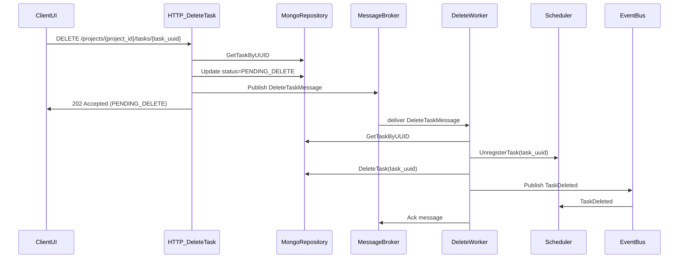

## Durable Task Delete Flow

This document describes the durable, asynchronous task deletion workflow for cron tasks in the backend.  
The key goals are:

- Ensure **no cron continues running** after a delete has been requested.
- Make deletion **retryable and idempotent** via an external message broker.
- Keep the data model using **hard deletes** (no long-lived `DELETED` state in Mongo), while still tracking transient delete lifecycle states.

---

## 1. Task delete lifecycle (hard delete with transient states)

We extend `TaskStatus` in `backend/internal/models/task.go` with two internal-only values:

- `PENDING_DELETE` — delete has been requested and a job is (or will be) enqueued.
- `DELETE_FAILED` — an attempted delete failed; the task is not scheduled anymore, but the record still exists and needs attention.

These are **orchestration states only**. Once deletion fully succeeds, the task document is **hard-deleted** from MongoDB (`DeleteOne`), so there is no long‑term `DELETED` status stored in the database.

Public APIs (`CreateTask`, `UpdateTask`, `UpdateTaskStatus`) continue to accept only `ACTIVE` and `DISABLED` from clients; `PENDING_DELETE` / `DELETE_FAILED` are set by the backend workflow.

Scheduler code already treats only `ACTIVE` tasks (with cron expressions, and in active groups) as runnable, so `PENDING_DELETE` / `DELETE_FAILED` are naturally treated as non‑runnable.

---

## 2. High‑level workflow

The delete flow is split into two phases:

1. **API phase (schedule delete)** — mark the task as `PENDING_DELETE`, enqueue a delete job, return `202 Accepted`.
2. **Worker phase (execute delete)** — stop cron, hard‑delete from Mongo, emit `TaskDeleted`, then ack the job.

### 2.1 Sequence diagram



---

## 3. API layer: schedule delete, don’t execute it

`TaskHandler.DeleteTask` in `backend/internal/handlers/tasks.go` is updated to:

1. Parse `project_id` and `task_uuid`; optionally verify the task belongs to the project.
2. Load the task via `repo.GetTaskByUUID`:
   - If not found → treat as idempotent, respond `202 Accepted` with `{ "status": "ALREADY_DELETED" }`.
3. Set status to `PENDING_DELETE` using `repo.UpdateTaskStatus(ctx, taskUUID, TaskStatusPendingDelete)`.
4. Publish a `DeleteTaskMessage` to the external message broker (see below).
5. Respond with **`202 Accepted`** and a body like:

   ```json
   {
     "status": "PENDING_DELETE",
     "task_uuid": "<uuid>",
     "message": "Task deletion has been scheduled"
   }
   ```

The existing `204 No Content` behavior is replaced by this **asynchronous** contract.

If publishing to the broker fails, we can either:

- Roll back status to the previous value and return `500`, or
- Leave status as `PENDING_DELETE`, log the error, and rely on the reconciler (see §5) to re‑enqueue the job.

For simplicity, we can start with the first option and evolve to the second once the reconciler is in place.

---

## 4. Delete job message & broker abstraction

We define a small message contract, e.g. in `backend/internal/deletequeue/message.go`:

```go
type DeleteTaskMessage struct {
    TaskUUID     string    `json:"task_uuid"`
    ProjectID    string    `json:"project_id"`
    RequestedAt  time.Time `json:"requested_at"`
    RequestID    string    `json:"request_id,omitempty"`
}
```

We also define broker‑agnostic interfaces in `backend/internal/deletequeue/queue.go`:

```go
type DeleteJobPublisher interface {
    PublishDeleteTask(ctx context.Context, msg DeleteTaskMessage) error
}

type DeleteJobConsumer interface {
    Start(ctx context.Context, handler func(context.Context, DeleteTaskMessage) error) error
}
```

Concrete implementations (RabbitMQ, SQS, Redis queue, etc.) live behind these interfaces so the rest of the code stays independent of the specific broker.

---

## 5. Delete worker: stop cron → hard delete → ack

The delete worker (e.g. `backend/internal/deleteworker/worker.go`) is responsible for actually performing the deletion.

Dependencies:

- `repo repositories.Repository`
- `scheduler` (same interface used in `TaskHandler` – provides `UnregisterTask(uuid string)`)
- `eventBus *events.EventBus`
- `consumer DeleteJobConsumer`

Core logic (idempotent and retryable):

```go
func (w *Worker) processDeleteTask(ctx context.Context, msg DeleteTaskMessage) error {
    task, err := w.repo.GetTaskByUUID(ctx, msg.TaskUUID)
    if errors.Is(err, mongo.ErrNoDocuments) {
        // Already deleted – safe to ack.
        return nil
    }
    if err != nil {
        return err // retry via broker
    }

    // 1) Stop cron (idempotent: safe to call many times).
    if w.scheduler != nil {
        w.scheduler.UnregisterTask(task.UUID)
    }

    // 2) Hard delete from Mongo.
    if err := w.repo.DeleteTask(ctx, task.UUID); err != nil {
        // Optional: mark as DELETE_FAILED for observability.
        _ = w.repo.UpdateTaskStatus(ctx, task.UUID, models.TaskStatusDeleteFailed)
        return err // no ack; broker will retry
    }

    // 3) Publish TaskDeleted event (scheduler will unregister again, no-op).
    w.eventBus.Publish(events.Event{
        Type: events.TaskDeleted,
        Payload: events.TaskDeletedPayload{
            TaskUUID: task.UUID,
        },
    })

    // Returning nil tells the consumer to ack the message.
    return nil
}
```

The `DeleteJobConsumer.Start` implementation is responsible for:

- Calling `processDeleteTask` for each message.
- Acknowledging only when `processDeleteTask` returns `nil`.
- Letting the broker handle retries / DLQ for non‑nil errors.

Because `UnregisterTask` and “task not found” behavior are idempotent, re‑delivery is safe:

- If cron was already stopped → `UnregisterTask` is a no‑op.
- If Mongo record was already deleted → `GetTaskByUUID` returns `ErrNoDocuments` and we treat the job as successfully completed.

This directly answers the concern: **if cron is unregistered but Mongo delete fails**, the worker returns an error, the message is retried, and subsequent attempts see “no cron to stop” but can still retry the Mongo delete until it succeeds or lands in DLQ.

---

## 6. Reconciler for stuck `PENDING_DELETE` / `DELETE_FAILED`

To cover edge cases (e.g. status updated but job publish failed, or repeated failures), we add a small reconciler, e.g. `backend/internal/reconciler/delete_reconciler.go`:

- Runs on a ticker inside the main backend process (e.g. every 1–5 minutes).
- Queries tasks where `status` is `PENDING_DELETE` or `DELETE_FAILED`.
- For each such task:
  - Re‑publish a `DeleteTaskMessage` via `DeleteJobPublisher.PublishDeleteTask`.
  - Optionally, only re‑publish if `updated_at` is older than a threshold (e.g. 5–10 minutes) to avoid constant re‑queues while a worker is actively retrying.

This ensures that:

- If the API managed to set `PENDING_DELETE` but broker publish failed, the task is eventually re‑enqueued.
- If a worker crashed mid‑flow and the message was lost or parked in DLQ, you have a clear set of `PENDING_DELETE` / `DELETE_FAILED` tasks to inspect and re‑trigger.

---

## 7. Frontend behavior

- The UI should treat task deletion as **eventually consistent**:
  - On `202 Accepted` with `status: \"PENDING_DELETE\"`, show a toast like \"Task deletion scheduled\".
  - Option A: Optimistically remove the task from the list.
  - Option B: Keep it with a `PENDING_DELETE` badge until a background refetch shows it gone.
- Re‑issuing a delete for the same task is safe:
  - If the task is already gone, the API returns `202` + `ALREADY_DELETED`.
  - If still `PENDING_DELETE`, the API can either be a no‑op or re‑enqueue another delete job; both are safe due to worker idempotency.

---

## 8. Implementation checklist

- [ ] Add `PENDING_DELETE` and `DELETE_FAILED` to `TaskStatus` (internal use only).
- [ ] Ensure scheduler and status‑validation paths ignore / disallow these values from external clients.
- [ ] Define `DeleteTaskMessage` and `DeleteJobPublisher` / `DeleteJobConsumer` abstractions.
- [ ] Refactor `TaskHandler.DeleteTask` to set `PENDING_DELETE`, publish a delete job, and return `202 Accepted` with a JSON body.
- [ ] Implement the delete worker (`deleteworker`) that stops cron, hard‑deletes from Mongo, publishes `TaskDeleted`, and only then acks the job.
- [ ] Add a periodic reconciler to re‑enqueue `PENDING_DELETE` / `DELETE_FAILED` tasks.
- [ ] Wire broker config + worker startup in `main` and update frontend to handle the new async delete contract.

